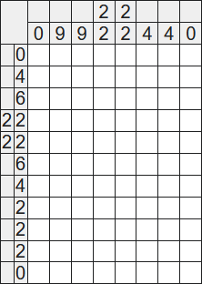
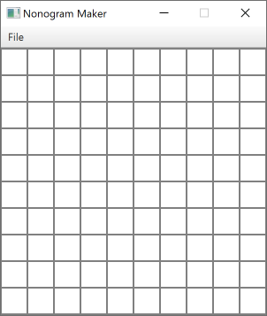
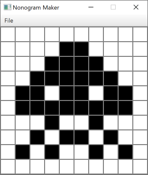
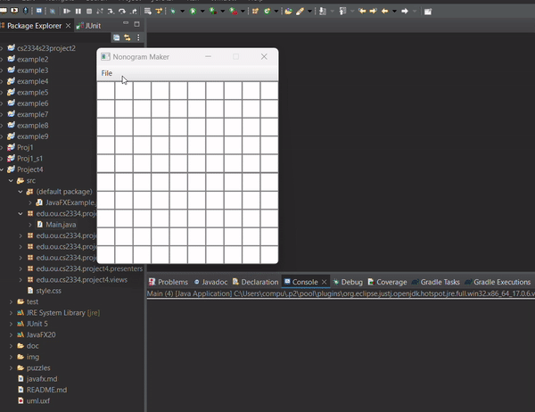
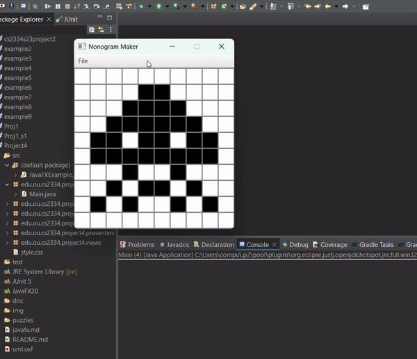
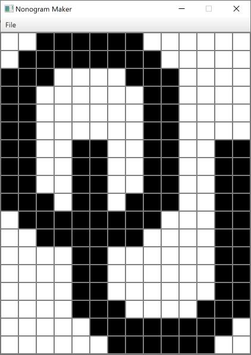
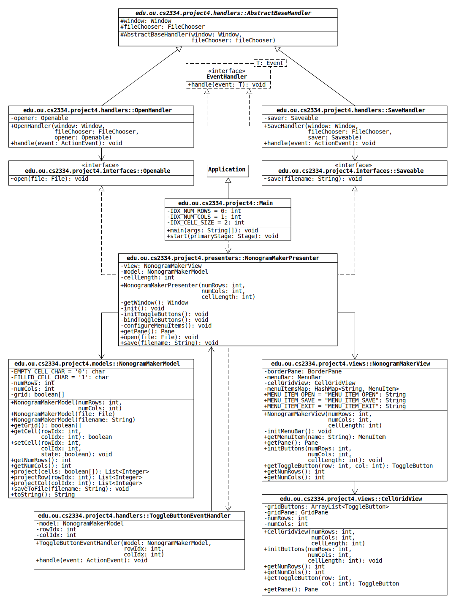
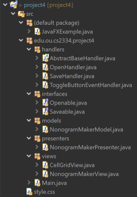
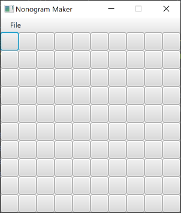

[](https://classroom.github.com/a/0fRJ29ba)
# Project 4: A Simple Nonogram Maker

> There are two ways of constructing a software design: One way is to make it
> so simple that there are obviously no deficiencies, and the other way is to
> make it so complicated that there are no obvious deficiencies. The first method is far more difficult.
>
> &mdash;C.A.R. Hoare (British computer scientist, winner of the 1980 Turing Award)

[Nonograms](https://en.wikipedia.org/wiki/Nonogram) are grid-based logic puzzles invented independently by Non Ishida and Tetsuya Nishio in 1987.
Over the past decade, they've become increasingly popular in video game form, where they are more commonly known by Nintendo's trademarked name, "Picross" (a portmanteau of "picture" and "crossword").

A nonogram consists of a grid of cells in which each row and each column are labeled by a list of numbers.
The cells can be in two states, empty or filled, and the numbers indicate which cells are filled.
Specifically, the numbers are the lengths of the contiguous groups of filled cells in the row or column.
The cells are initially empty, and the goal is to fill the correct cells to satisfy the numbers.

Here is an example [from Wikipedia](https://en.wikipedia.org/wiki/Nonogram#Example):



The 0 that labels the first row indicates that none of the cells are filled.
The 4 that labels the second row indicates that 4 of the 8 cells are filled, and there are no empty cells between any pair of filled cells (i.e., the filled cells are in a single contiguous group).
The pair of 2s that labels the fourth row indicates that there are two contiguous groups of 2 filled cells, and the groups are separated by one or more empty cells.

The solution to the puzzle is shown below, and it illustrates the feature of nonograms that is responsible for their popularity: Solving the puzzle reveals a hidden [binary image](https://en.wikipedia.org/wiki/Binary_image)!
In this example, the image is a boring letter P, but puzzles can be generated from any two-color [pixel art](https://en.wikipedia.org/wiki/Pixel_art).


For Project 4, we will write a nonogram puzzle maker.
The program will have a graphical interface that allows a user to draw a binary image.
The program will take this image and calculate the row and column numbers of the corresponding nonogram.

## Installing JavaFX

The graphical interface of the nonogram maker will be created with [JavaFX](https://en.wikipedia.org/wiki/JavaFX).
To use the library, we need to download and manually add it to the build path.
See the document [javafx.md](javafx.md) for instructions on how to do this.

## User Interface Description

This program runs using command line arguments specifying the number of rows, number of columns, and cell length (i.e., the size of a square).

```console
$ Main <numRows> <numCols> <cellLength>
```

When the program starts, the user is shown an empty cell grid of the specified dimensions:



The user draws an image by clicking on cells, which toggles their state from empty to filled (or vice versa).
For instance, here is a recreation of one of the alien [sprites](https://en.wikipedia.org/wiki/Sprite_(computer_graphics)) from the 1978 arcade game [*Space Invaders*](https://en.wikipedia.org/wiki/Space_Invaders):



The top of the window has a menu bar with a menu option called **File**. By clicking on the **File** option, the user is given three options: **Open**, **Save**, or **Exit**. Open is used to load a puzzle file. Save is used to save the nonogram to a file. Exit is used to close the program.


### Opening a Puzzle



### Saving a Puzzle



Clicking the save button using the Space Invaders pattern creates allows us to save a text file with the following content:

```text
10 10
0
2
4
6
2 2 2
8
1 1
1 2 1
1 1 1 1
0
0
2 1
3 1
2 2 1
5 1
5 1
2 2 1
3 1
2 1
0
0000000000
0000110000
0001111000
0011111100
0110110110
0111111110
0001001000
0010110100
0101001010
0000000000
```


The first line contains the dimensions of the cell grid: the number of rows *R* followed by the number of columns *C*.
The next *R* lines contain the nonogram numbers for the rows in order from top to bottom with one row per line.
Similarly, the final *C* lines contain the nonogram numbers for the columns in order from left to right with one column per line.
The remaining lines represent the rows and columns of the cell grid where 0s represent empty cells and 1s represent filled cells.

Below is a second example recreating the OU logo.
The text files for both examples can be found in the [puzzles](puzzles) directory of this repository



## Program Design

The nonogram maker consists of the classes shown in the UML diagram below.
(See [uml.pdf](img/uml.pdf) for a larger version.)



The diagram includes three symbols that have not appeared in earlier assignments:

1. A dashed line with an open arrowhead indicates a dependency.
The class touching the back of the arrow has a method parameter or local variable (but not a field) whose type is the class that touches the arrowhead.
For instance, the `start()` method in the Main class has a local variable of type NonogramMakerPresenter, so the diagram has a dashed, open arrow pointing from Main to NonogramMakerPresenter.

2. A solid line with an open arrowhead indicates an association.
The class touching the back of the arrow has a field whose type is the class that touches the arrowhead.
The one example in the diagram is ToggleButtonEventHandler, which has a field of type NonogramMakerPresenter.

3. A tilde (~) indicates package-private visibility. This occurs when an attribute has no visibility modifier (i.e., no public, private, protected). It is visible only within its own package.

Furthermore, we use [packages](https://docs.oracle.com/javase/tutorial/java/package/index.html) to better organize our code. In the UML diagram, you will see class names in the form **package::class**. For instance, **edu.ou.cs2334.project4::Main** means the Main class is in the package `edu.ou.cs2334.project4`.

To create a new package in Eclipse, you can do the following:

1. Right-click on your project in the **Package Explorer**
1. Go to **New > Package**
1. Enter the name of the package you want to create (e.g., `edu.ou.cs2334.project4`)
1. Click **OK**

After making your packages, you can create classes as you have done in the past.

#### code organization
Your code organization will look like the screenshot below:



You may notice that the dot in the package names acts in a similar manner to slashes in a file path (e.g., `edu.ou.cs2334` is like `edu/ou/cs2334`).

When writing these classes, feel free to add fields to make the code more efficient or readable.
Doing this may change some of the dependencies into associations, which is fine.
(For instance, if a view class has a field that stores the model reference passed to its constructor, its dependence on NonogramMakerModel becomes an association.)
Dependency arrows in the diagram simply indicate that although a class uses an object of another class, it can be implemented without storing a reference to the object between method calls.

### Model-View-Presenter

The design of our program employs an [architectural pattern](https://en.wikipedia.org/wiki/Architectural_pattern) known as "[model-view-presenter](https://en.wikipedia.org/wiki/Model%E2%80%93view%E2%80%93presenter)."
This pattern separates the state of the nonogram maker (model) from the state of the graphical interface (view) and uses a third component (presenter) to synchronize them.

You will notice that we define some components (e.g., menu items, buttons) without defining behaviors/actions in the view classes. These behaviors are instead configured in the presenter class. To allow the presenter to modify the behavior of the view components, we define component getters in the view classes.

### NonogramMakerModel

This class contains the functionality of the puzzle maker that is independent of the graphical interface.
It encapsulates a one-dimensional array of boolean values that stores the state of each grid cell (false for empty; true for filled).
The array is indexed using (row-major ordering)[https://en.wikipedia.org/wiki/Row-_and_column-major_order].
Methods of the class are used to calculate the nonogram numbers and save them to text files.

* `NonogramMakerModel(int numRows, int numCols)`: Create a 1D boolean array with the given number of rows and columns. With *R* rows and *C* columns, how many entries are there altogether?

* `NonogramMakerModel(File file)`: Construct a NonogramMakerModel by reading in data from a file. Refer to the file format above to determine what data you can use to populate the grid array.

* `NonogramMakerModel(String filename)`: Construct a NonogramMakerModel by reading in data from a file given a filename. You can accomplish this with a one-liner.

* `getGrid()`: Return a copy of the grid array.

* `getCell(int rowIdx, int colIdx)`: Return the cell state at a given position.

* `setCell(int rowIdx, int colIdx, boolean state)`: Update the cell state at a given position.

* `getNumRows()`: Return the number of grid rows.

* `getNumCols()`: Return the number of grid columns.

* `project(boolean[] cells)`: Return the nonogram numbers of the given array of cell states.
We will refer to this operation as "projecting" the array, and the list of numbers will be called a "projection."
Look at the examples provided earlier to get an idea of how a row or column of cells is projected.

* `projectRow(int rowIdx)`: Return the projection of the row with the given index. You can accomplish this with about five lines of code.

* `projectCol(int colIdx)`: Return the projection of the column with the given index. You can accomplish this with about five lines of code.

* `saveToFile(String filename)`: Save the output of toString to a text file with the given name.

* `toString()`: Return a string representation of the puzzle.
The first line contains the dimensions of the cell grid. The next part of the file contains projections of the rows and columns. The last part of the file encodes the grid elements. 0s represent empty cells and 1s represent filled cells.

### NonogramMakerView

This class creates a [BorderPane](https://openjfx.io/javadoc/11/javafx.graphics/javafx/scene/layout/BorderPane.html) with a graphical interface for the puzzle maker.
The center position contains the pane created by CellGridView, and the top position contains a [MenuBar](https://openjfx.io/javadoc/11/javafx.controls/javafx/scene/control/MenuBar.html).
To allow the NonogramMakerPresenter to define the behaviors of the menu bar items, we define a getter method to retrieve items stored in a hash map.
The keys of the hash map are given in the UML diagram as String constants.
Below is an image of the user interface with the default JavaFX style sheet:



* `NonogramMakerView(int numRows, int numCols, int cellLength)`: Construct a NonogramMakerView.
    1. Initialize the BorderPane and CellGridView.
    1. Initialize the MenuBar (note that there's a helper method for this).
    1. Set the top and center elements of the BorderPane as described above.

* `initMenuBar()`: Initialize menuBar and menuItemsMap.
    1. Create a Menu using the String argument "_File" (the underscore is specified to allow keyboard shortcuts involving the ALT key).
    1. Create three MenuItems using the String arguments  "_Open", "_Save", and "_Exit" to the "_File" Menu.
    1. Add the MenuItems to the Menu and the HashMap (use the constants in the UML diagram as key Strings).
    1. Add an [ActionEvent](https://openjfx.io/javadoc/11/javafx.base/javafx/event/ActionEvent.html) [EventHandler](https://openjfx.io/javadoc/11/javafx.base/javafx/event/EventHandler.html) to the Exit menu item that executes `Platform.exit();`. This will make the program close when the Exit item is pressed.
    1. Instantiate the menuBar and add the File menu to the menuBar. This will allow the File option to show up on the menuBar.

* `getMenuItem()`: Return the MenuItem associated with a given key String.

* `getPane()`: Return the pane associated with this view.

* `initButtons()`: Call the initButtons method on the cellGridView variable.

* `getToggleButton()`: Return the toggleButton at a given position using the cellGridView variable.

* `getNumRows()`: Return the number of rows using the cellGridView variable.

* `getNumCols()`: Return the number of columns using the cellGridView variable.

### CellGridView

This class creates a [GridPane](https://openjfx.io/javadoc/11/javafx.graphics/javafx/scene/layout/GridPane.html) of [ToggleButtons](https://openjfx.io/javadoc/11/javafx.controls/javafx/scene/control/ToggleButton.html) that is the primary component of the puzzle maker interface.
The user clicks the buttons to draw an image, and the buttons update the cell states in the model.

Because the presenter class needs access to the ToggleButtons to define their behavior (e.g., updating a cell in the model when clicked), we create an ArrayList to store them. The ArrayList is one-dimensional, as it was in the NonogramMakerModel. Again, it uses row-major ordering.

* `CellGridView(int numRows, int numCols, int cellLength)`: Initialize instance variables and set the alignment of the grid to the [Pos](https://openjfx.io/javadoc/11/javafx.graphics/javafx/geometry/Pos.html) value CENTER. Also, initialize the toggle buttons using the helper method.

* `int getNumRows()`: Return the number of rows.

* `int getNumCols()`: Return the number of columns.

* `initButtons(int numRows, int numCols, int cellLength)`: Creates buttons according to the given parameters.
    1. Update instance variables to match the given arguments.
    1. Clear the gridButtons ArrayList and gridPane children list. **Do not re-initialize these variables by using the new keyword.** We clear them to make sure the original references are still accessible, even as we add more buttons/remove buttons as different puzzles are loaded in with different sizes (e.g., going from a 5x5 grid to a 10x7 grid). The presenter will hold a reference to the original gridPane. If we were to re-initialize the gridPane in this method, the presenter itself would see no changes to the number of buttons.
    1. Create ToggleButtons for each element of the grid. Set the minimum, maximum, and preferred widths of each toggle button to the cell length passed to the constructor. Do the same thing for the minimum, maximum, and preferred heights.

* `getToggleButton(int row, int col)`: Return the toggle button at a given position.

* `getPane()`: Return the pane associated with this view.

### ToggleButtonEventHandler

This class implements the [EventHandler](https://openjfx.io/javadoc/11/javafx.base/javafx/event/EventHandler.html) interface for the [ToggleButtons](https://openjfx.io/javadoc/11/javafx.controls/javafx/scene/control/ToggleButton.html) in CellGridView.

* `handle(ActionEvent event)`: Get the current state of the toggle button&mdash;selected (true) or not selected (false)&mdash;and set the cell in the model with the same row and column indices to the same boolean value.

### NonogramMakerPresenter

This class represents the brain of this program. The graphical view and model data are connected by the presenter.

Because the size of a NonogramMakerModel is immutable, any size adjustments (rows or columns) require re-initializing the model and view information. The model reference is completely updated. The view reference stays the same, though underlying data within the view undergoes change (e.g., the CellGridView initButtons method). These changes are done through the `init()` method.

* `NonogramMakerPresenter(int numRows, int numCols, int cellLength)`: Initialize the model and view instance variables, set the cellLength instance variable, and call the `init()` method.

* `getWindow()`: Return the view's pane's scene's window. Catch any NullPointerExceptions and return null.

* `init()`: Initialize the toggle buttons, bind the toggle buttons to the model, and configure menu item actions (by calling the three associated helper methods).

* `initToggleButtons()`: Call the view's initButtons method using the model's row/column count and the cellLength instance variable. If the window is not null, execute `getWindow().sizeToScene()` to make sure the window is not too big/too small.

* `bindToggleButtons()`: bindToggleButtons(): For each grid cell, make sure the view's toggle button selected status matches the model's cell state (hint, there's a `setSelected` method for ToggleButtons). Also, add a ToggleButtonEventHandler to each button.

* `configureMenuItems()`: Set the event handlers for the Open and Save buttons. Refer to the [FileChooser](https://openjfx.io/javadoc/11/javafx.graphics/javafx/stage/FileChooser.html) documentation for ideas on generating open/save file dialogs.

    For the Open button, you will want to do the following. For the Save button, you will do something similar.
    ```java
    FileChooser fileChooser = new FileChooser();
    fileChooser.setTitle("Open");
    fileChooser.getExtensionFilters().addAll(new ExtensionFilter("Text Files", "*.txt"));
    fileChooser.setInitialDirectory(new File("."));
    view.getMenuItem(NonogramMakerView.MENU_ITEM_OPEN)
        .setOnAction(new OpenHandler(getWindow(), fileChooser, this));
    ```

* `getPane()` Return the pane associated with the view.

* `open(File file)`: Re-initialize the model variable by calling the appropriate NonogramMakerModel constructor. Then, call the `init()` method. This should take two lines of code.

* `save(String filename)`: Call the model's saveToFile method using the given filename. This should be a one-liner.

### Openable and Saveable

These are simple interfaces used to specify that a class has a special method to handle opening a file or saving a file. The NonogramMakerPresenter implements these interfaces. This allows the OpenHandler and SaveHandler classes to handle file opening and file saving.

### AbstractBaseHandler

This class represents a general handler involving file selection. Its constructor should assign its instance variables.

### OpenHandler and SaveHandler

These classes extend the AbstractBaseHandler class. They each implement the EventHandler interface and must implement the handle method. Each handle method should use the FileChooser instance variable to show an open dialog/save dialog to the user. Then, if the dialog result (a File) is not null, call the appropriate Openable/Saveable method using the specified file.

### Main

Any program that uses JavaFX must have a driver class that extends [Application](https://openjfx.io/javadoc/11/javafx.graphics/javafx/application/Application.html).
Main creates the application window and has methods to display the options menu and the puzzle maker.

* `main(String[] args)`: Call the inherited launch method as shown in JavaFXExample.

* `start(Stage primaryStage)`: Start the application.
    
    1. Use the [`getParameters()`](https://openjfx.io/javadoc/11/javafx.graphics/javafx/application/Application.html#getParameters()) method to extract the number of rows, number of columns, and cell size.
    1. Construct a NonogramMakerPresenter.
    1. Create a [Scene](https://openjfx.io/javadoc/11/javafx.graphics/javafx/scene/Scene.html) with the NonogramMakerPresenter's pane and set it on the primary [Stage](https://openjfx.io/javadoc/11/javafx.graphics/javafx/stage/Stage.html).
    1. Add the style sheet `style.css` to the scene. If you dislike the color scheme, create your own style sheet! (The file `style.css` is included in the src directory.)
    1. Add the application name to the title bar, prevent the window from resizing, and then show the window.

## Submission and Grading


You will be graded on: 
* #### Zybooks submission: 120 points
   - Submit "NonogramMakerModel.java" and pass the testcases on Zybooks before due date.
   - **No late submissions will be accepted/graded.**
   - Note that the data file used in Zybooks is different from the one in GitHub so your solution should be a general solution.

* #### Github commits : 30 points
  - Commit your project (Before the due date) with the same design explained in [here](#Program-Design) and organize your project as in [here](#code-organization)
    
* #### Javadocs: 20 points
  - Create complete documents and commint (doc folder) along with your project on github

* #### Presentation: 30 points
  - You are required to attend either of the help session (Zoom) on the following date and present(run) your project. your point will be based on the performance of your code (full points if everything works properly).
   -  - Tuesday      8/1/2023  2:00-3:00pm CDT
      - Wednesday    8/2/2023  2:00-3:00pm CDT
      - Thursday     8/3/2023  2:00-3:00pm CDT 


Plagiarism will not be tolerated under any circumstances. Participating students will be penalized depending on the degree of plagiarism. It includes "No-code" sharing among the students. It can lead to academic misconduct reporting to the authority if identical code is found among students. 
Submit your project before the due date/time. **No late submissions allowed.**
