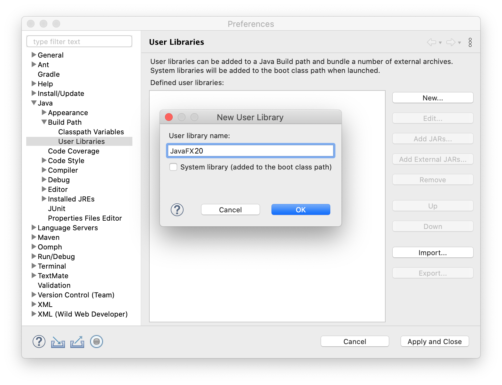

# JavaFX Installation Guide

This guide will show you how to download JavaFX and create an Eclipse project that uses the library.
The instructions are largely taken from [this site](https://openjfx.io/openjfx-docs/), which you should visit if you plan to use a different IDE.
You can find instructions for IntelliJ and NetBeans by clicking on the links on the left side of the page.
(Follow the non-modular version of the instructions for your IDE.)

## Download JavaFX

The standalone JavaFX module is hosted by the company Gluon on [this page](https://gluonhq.com/products/javafx/).
Download version 20 of the SDK (not the jmods) for your operating system.

The SDK will be downloaded as a zip file.
Extract the contents to a convenient location.
On my Windows computer, for example, I extracted them to the desktop, which creates the folder `C:\Users\Reza\Desktop\javafx-sdk-20.0.1`.

## Add JavaFX to Eclipse

Open the preferences window in Eclipse.
(If you're running Windows, select **Window** and then **Preferences** from the menu bar.
If you're running macOS, select **Eclipse** and then **Preferences...**.)
In the list on the left side, click the arrowheads next to **Java** and **Build Path** and then select **User Libraries**.

The right side of the window should now show a list of user libraries, which is probably empty.
Click **New...** and type `JavaFX20` in the window that appears. 
Do not check the option to add the library to the boot class path.
Click **OK** to add the name to the list of user libraries.



Select **JavaFX20** from the list, and click **Add External JARs...**.
Navigate to the location where you extracted the SDK, and open the `lib` subfolder.
You will see a bunch of jar files that begin with the text "javafx" (e.g., `javafx.base.jar` and `javafx.controls.jar`).
Select all of the jar files and click **Open** to add them to the user library.
Click **Apply and Close** to close the preferences window.


## Add JavaFX to the Build Path

If you have not done so already, clone this repo and open the project in Eclipse.
Then open the class JavaFXExample in the editor.
Notice that all of the JavaFX import statements are underlined in red.
This is because Eclipse does not know where to find these classes.
To fix the problem, we need to add JavaFX to the build path.

Right-click the project folder in the package explorer.
In the dropdown menu, select **Build Path** and then **Configure Build Path...**.
This opens the properties window for the project.

On the right side of the window, click the Libraries tab.
Select **Classpath** from the list below the text "Jars and class folders on the build path," and then click **Add Library...**.
In the window that appears, select **User Library** and then click **Next**.
Check the box next to **JavaFX20** and click **Finish**.

Click **Apply and Close** to close the properties window.
If you followed these steps correctly, the JavaFX20 library will appear in the package explorer along with the JRE System Library, and the import statements in JavaFXExample will no longer be underlined.

## Add a Run Configuration

Right-click JavaFXExample in the package explorer, and select **Run As** and then **Java Application**.
The program will compile, but you will receive the following console message:

```text
Error: JavaFX runtime components are missing, and are required to run this application
```

To fix this, we need to pass a couple of arguments to the Java virtual machine so it knows where to find the JavaFX module.

Right-click JavaFXExample again, but this time select **Run As** and then **Run Configurations...**.
This opens the run configurations window.

On the right side of the window, click the Arguments tab.
In the box labeled "VM arguments," add the following text:

```text
--module-path "path-to-javafx-lib-folder" --add-modules javafx.controls,javafx.fxml
```

Replace `path-to-javafx-lib-folder` with the path to the folder containing the JavaFX jar files.
For instance, on my Windows computer, the correct VM arguments are shown below.
(Note that Windows file paths use backslashes while macOS file paths use forward slashes.)

```text
--module-path "C:\Users\Reza\Desktop\javafx-sdk-20.0.1\lib" --add-modules javafx.controls,javafx.fxml
```

You may see an option below the VM arguments box with the label "Use the -XstartOnFirstThread argument when launching with SWT."
Make sure this option is not checked.


Click **Apply** and then **Run** to close the run configurations window and run the program.
If you entered the arguments correctly, a window will appear that looks like this image:


Congratulations!
You just ran your first JavaFX program.
Keep these instructions handy to help you configure your future JavaFX projects.
For each project, you will need to repeat the steps to add the user library to the build path and the VM arguments to the run configuration.
